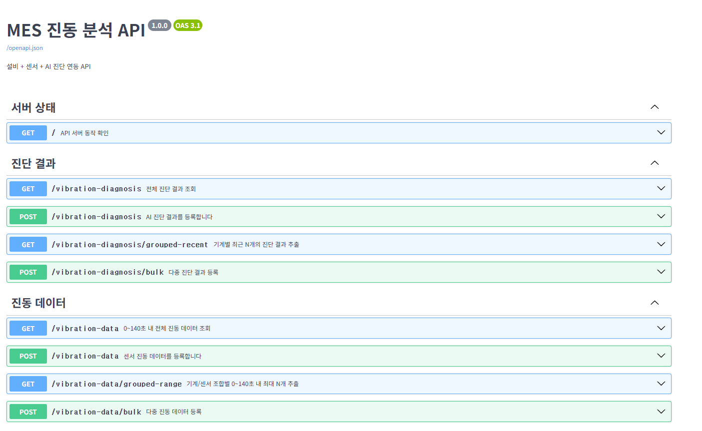

# 프로젝트 HIM-MES

## 1. 프로젝트 개요 📌

### 1.1 프로젝트명 📁

스마트 팩토리 MES(Manufacturing Execution System) 프로젝트

### 1.2 프로젝트 설명 📝

모듈형 MES 공정 데이터 파이프라인 설계 프로젝트입니다.
데이터 분석이 아닌, 데이터 기반 의사 결정 인프라를 구축하는 데 중점을 두었습니다.

## 참여자
- 김민창 (DB/백엔드/대시보드)
- 지평진, 고찬국, 김사무엘, 송창우

---

## 1. 내가 맡은 역할 ✍

### ☁️ 클라우드 서버 관리
- AWS EC2 인스턴스를 이용한 FastAPI 서버 호스팅
- Docker를 활용한 FastAPI 컨테이너화 및 자동화 배포
- AWS RDS(MySQL) 연동 및 보안 그룹, 포트 설정 최적화

### 🗄️ DB 설계 및 관리
- MySQL 기반 진동 수집 및 진단 테이블 스키마 설계
- SQLAlchemy를 활용한 ORM 매핑 및 데이터 모델링
- `measured_time` 기반 대용량 데이터 저장 및 조회 쿼리 최적화
- 150만 건 이상 진동 데이터를 중복 검사 및 자동 업로드 스크립트 구현

### 🔧 API 개발 및 관리
- FastAPI 기반 RESTful API 설계 및 구현
- `/vibration-data`, `/vibration-diagnosis` 등 핵심 진동 데이터 관리 API 개발
- 기계별 최근 진단 데이터 조회용 고급 SQL 서브쿼리 및 응답 구조 설계
- Swagger 문서 자동화 및 팀원 테스트 환경 제공

### 🎨 대시보드 제작
- Streamlit 기반 진동 파형 시각화 대시보드 개발 (초기 테스트용)
- Vercel에 배포된 Next.js 기반 진단 결과 시계열 대시보드 제작
- Recharts, Chart.js 등 라이브러리를 활용한 실시간 고장 히스토리 시각화
- 사용자 필터(기계명, 날짜, 상태 유형) 및 커스텀 툴팁 UI 구성

---

## 2. 🧰 사용 기술 스택 (Used Tech Stack)

### 🔙 백엔드 / 서버


### 🧮 데이터베이스


### 🎨 대시보드 / 프론트엔드


### ☁️ 클라우드 / 배포


### 🔧 개발 도구


### 📄 기타 정보


---

## 내가 했던 일들에 대한 자세한 개요.

## 1. DB (MySQL)

### ✅ 어떤 작업을 했는가?

MES 시스템의 진동 수집 및 AI 진단 결과 처리를 위한 데이터베이스를 설계하였습니다.  
초기에는 AI 학습 데이터의 구조조차 명확하지 않은 상태였고, 이에 따라 일반적인 MES 구성을 바탕으로 **예비 테이블**을 먼저 구성했습니다.

---

### 🔎 초기 예비 테이블 설계

아래는 MES에서 자주 활용되는 구조를 참고하여 설계한 예비 테이블입니다:

```sql
-- 설비 마스터 테이블
CREATE TABLE equipment_info (
    equipment_id VARCHAR(50) PRIMARY KEY,
    name VARCHAR(100),
    location VARCHAR(100),
    installed_at DATE
);

-- 설비 상태 기록 테이블
CREATE TABLE equipment_data (
    id INT PRIMARY KEY AUTO_INCREMENT,
    equipment_id VARCHAR(50),
    image_path VARCHAR(255),
    status ENUM('running', 'stop', 'error') DEFAULT 'stop',
    temperature DECIMAL(10,3),
    speed DECIMAL(10,3),
    runtime DECIMAL(10,3),
    timestamp DATETIME DEFAULT CURRENT_TIMESTAMP,
    FOREIGN KEY (equipment_id) REFERENCES equipment_info(equipment_id)
);

-- 이상 탐지 기록 테이블
CREATE TABLE anomaly_log (
    id INT PRIMARY KEY AUTO_INCREMENT,
    equipment_id VARCHAR(50),
    model_name VARCHAR(30),
    message VARCHAR(255),
    severity ENUM('1','2','3','4','5'),
    detected_at DATETIME DEFAULT CURRENT_TIMESTAMP,
    FOREIGN KEY (equipment_id) REFERENCES equipment_info(equipment_id)
);

-- 품질 검사 기록 테이블
CREATE TABLE quality_log (
    id INT PRIMARY KEY AUTO_INCREMENT,
    product_name VARCHAR(50),
    equipment_id VARCHAR(50),
    measure_item VARCHAR(20),
    measured_value DECIMAL(10,3),
    target_value DECIMAL(10,3),
    tolerance DECIMAL(10,3),
    timestamp DATETIME DEFAULT CURRENT_TIMESTAMP,
    FOREIGN KEY (equipment_id) REFERENCES equipment_info(equipment_id)
);
```
📌 당시에는 AI 학습 데이터의 구조와 진단 결과 형식에 대한 정보가 부족했기 때문에, 일반적인 예측 보전 시스템의 흐름을 참고하여 설계했습니다.

### 🧩 문제 파악 및 분석
이후 MLOps 팀과 협업하고, 실제 센서 수집 데이터를 분석한 결과,
사용한 데이터셋은 회전기계의 진동 데이터를 기반으로 하며, 일부러 고장 상태를 만들어 측정한 데이터셋임을 확인했습니다.

📄 진동 수집 데이터셋 주요 컬럼 구성

| 속성 (column) | 설명                                               | 비고   |
|---------------|----------------------------------------------------|--------|
| `Time`        | 데이터의 수집 시간 (측정 기준 시간)                | float |
| `Normal`      | 정상 상태 진동값                                   | float |
| `Type 1`      | 질량 불균형 고장 상태 진동값                       | float |
| `Type 2`      | 지지 불량 고장 상태 진동값                         | float |
| `Type 3`      | 질량 불균형 + 지지 불량 복합 고장 상태 진동값     | float |


📸 센서 데이터 예시
아래는 실제 사용된 회전기계 진동 데이터(g1_sensor1.csv)의 일부입니다.


🧠 AI 진단 결과 포맷
AI 진단 결과는 다음과 같은 형태의 fault_type 값으로 출력되며, 숫자별로 고장 유형을 의미합니다:

| 값 (`fault_type`) | 의미         |
|-------------------|--------------|
| `0`               | 정상         |
| `1`               | 질량 불균형  |
| `2`               | 지지 불량    |
| `3`               | 복합 불량    |

### 🛠️ 최종 테이블 재설계
실제 데이터와 진단 결과를 반영하여, 최소 구조로도 충분히 표현 가능한 DB 설계로 변경하였습니다:

```sql
-- 진동 수집 데이터 테이블
CREATE TABLE vibration_data (
    id INT AUTO_INCREMENT PRIMARY KEY,
    machine_name VARCHAR(50) NOT NULL,
    sensor_no VARCHAR(20) NOT NULL,
    collected_at DATETIME NOT NULL DEFAULT CURRENT_TIMESTAMP,
    measured_time FLOAT NOT NULL,
    normal FLOAT NOT NULL,
    unbalance FLOAT NOT NULL,
    looseness FLOAT NOT NULL,
    unbalance_looseness FLOAT NOT NULL
);

-- 진단 결과 테이블
CREATE TABLE vibration_diagnosis (
    id INT AUTO_INCREMENT PRIMARY KEY,
    machine_name VARCHAR(50) NOT NULL,
    detected_at DATETIME NOT NULL DEFAULT CURRENT_TIMESTAMP,
    fault_type TINYINT NOT NULL CHECK (fault_type IN (0, 1, 2, 3))
        COMMENT '0: 정상, 1: 질량 불균형, 2: 지지 불량, 3: 복합 불량'
);
```

### 📌 결과 및 의의

- ✅ 실제 사용 데이터 구조에 최적화된 형태로 재설계 완료
- ✅ AI 학습 및 진단 결과 저장/조회에 적합한 구조 구성
- ✅ FastAPI → Next.js 대시보드로 이어지는 전체 데이터 흐름의 기반을 직접 구축
- ✅ DB 설계 → 데이터 해석 → AI 연동까지 데이터 중심 아키텍처를 주도

## 2. AWS 서버 구성 (RDS, EC2)

### ✅ 많은 클라우드 서비스 중 AWS를 선택한 이유

처음 데이터베이스 구조를 구상하고, 팀원들과 실시간으로 공유하고 테스트할 방법을 고민하던 중  
**클라우드 기반의 데이터베이스 서비스**가 필요하다는 결론에 도달하였습니다.

이를 위해 여러 클라우드 플랫폼(Azure, GCP, Oracle Cloud 등)을 비교해보았고, 다음과 같은 조건을 만족하는 플랫폼이 필요했습니다:

1. **비용이 전혀 들지 않거나, 최소한으로 유지 가능할 것**  
2. **데이터 양(진동 센서 데이터)이 클 경우에도 수 GB~수 TB까지 확장 가능한 구조일 것**

이 중 Oracle Cloud는 "Always Free"라는 이름으로 일부 서비스를 무료 제공하긴 했지만,  
**90일 이상 비활성 시 영구 삭제될 수 있는 정책**을 가지고 있어  
실제 운영이나 장기 테스트 환경에서는 관리에 부담이 있었습니다.

반면 AWS는:

- 최초 가입 시 **1년간 프리 티어 제공**
- **RDS(관계형 DB 서비스)** 및 **EC2(서버 인스턴스)**를 모두 무료 범위 내에서 실습 가능
- 팀원이 동시에 접속해서 API나 대시보드를 테스트하기에 가장 유리

이러한 이유로 AWS의 **프리 티어 기반 RDS + EC2 조합이 가장 실용적**이라고 판단하여 사용하게 되었습니다.

### ✅ RDS를 사용하게 된 이유

데이터베이스 구조를 설계한 뒤, 이를 실제로 테스트하고 팀원들과 공유하려면  
**로컬 환경이 아닌, 외부에서도 접근 가능한 데이터베이스**가 필요했습니다.

처음에는 단순히 `.sql` 파일로 공유하거나, 각자 로컬 DB에 구성해보는 방법도 고려했지만  
- 팀원마다 DB 환경이 다르거나
- 운영체제에 따라 세팅이 번거롭고
- 실시간 협업/검증이 어렵다는 단점이 있었습니다.

그래서 고민 끝에 **클라우드 기반의 데이터베이스 서비스**가 필요하다는 결론에 도달하게 되었고,  
그 중에서도 AWS에서 제공하는 **RDS(Relational Database Service)**는 다음과 같은 장점을 가지고 있었습니다:

- 외부에서도 쉽게 접근 가능 (공용 Endpoint 제공)
- MySQL, PostgreSQL, Oracle 등 다양한 엔진 지원
- 보안 그룹과 IAM 설정을 통해 실무에 가까운 구조 테스트 가능
- FastAPI, Streamlit 등 외부 서버와 쉽게 연동 가능

결론적으로, **RDS를 통해 팀 전체가 동일한 DB 환경에서 협업하고, 실제 운영 환경처럼 API 서버와의 연결을 테스트**할 수 있어  
최종적으로 AWS RDS를 선택하게 되었습니다.

  
> AWS RDS 인스턴스 상태 화면 – MySQL 기반 `him-mes` 데이터베이스

### ✅ EC2를 사용하게 된 이유

처음 팀 프로젝트를 진행하면서, 팀원들과 논의한 결과  
**센서 데이터 외에도 이미지 데이터(예: 설비 상태 이미지)를 수집하고 저장할 필요**가 있다고 판단했습니다.

이때 이미지 데이터를 DB에 직접 저장할 수도 있지만,  
검색을 통해 알게 된 바에 따르면:

- 대용량 이미지 파일을 직접 DB에 저장하는 것은 **성능 저하와 관리 문제**를 유발할 수 있으며,
- 실무에서는 **이미지는 서버에 저장하고, 경로(path)만 DB에 기록하는 방식**을 주로 사용한다는 점을 확인하였습니다.

이러한 구조를 구현하기 위해서는 단순 DB만으로는 부족했고,  
**이미지 파일을 저장할 수 있는 별도의 서버 환경**이 필요했습니다.

그래서 AWS에서 제공하는 **EC2(Elastic Compute Cloud)** 인스턴스를 생성하여,  
**이미지를 저장할 수 있는 파일 서버**로 사용하고자 하였고, 실제로 EC2에 Ubuntu 기반 서버를 구축하여 준비를 진행하였습니다.

그러나 이후 팀 내의 AI 모델 학습을 담당하는 MLOps 팀이 **로컬에서 학습을 진행**하게 되면서,  
이미지 저장 기능은 실제 구현으로 연결되지는 않았으며,  
EC2는 결과적으로 다음과 같은 용도로 활용되었습니다:

- FastAPI 서버 실행 및 배포
- Swagger 문서 확인, 테스트
- 최종적으로는 Vercel로 이전된 Next.js 대시보드와의 연동 테스트

결론적으로 EC2는 **백엔드 API 서버 및 테스트 환경을 위한 가상 서버로서의 역할**을 성공적으로 수행하였습니다.

  
> FastAPI 서버가 배포된 EC2 인스턴스 실행 화면 (`him_EC2`)

#### ✅ 보안 설정 (추가 설명)

본 프로젝트는 팀 협업 및 테스트의 편의를 위해
**RDS와 EC2 모두 퍼블릭 접근(0.0.0.0/0 허용)** 상태에서 운영하였습니다.

- 이 설정은 실무 보안 기준에서는 권장되지 않는 방식이며,
**실제 운영 환경이라면 최소 권한 원칙(IP 제한 등)이 필요**합니다.

- **현재는 RDS 엔드포인트 보호, 비밀번호 설정, API 인증 등 최소한의 보안 조치는 적용**된 상태이며,
**향후에는 본인의 고정 IP만 허용하는 방식 등으로 보안을 상향할 계획**입니다.

#### ✅ EC2에 Docker 이미지로 FastAPI 배포

FastAPI 서버는 Docker로 컨테이너화한 뒤,  
로컬에서 `.tar` 파일로 저장한 Docker 이미지를 EC2에 업로드하여 실행하는 방식으로 배포하였습니다.

#### 📦 배포 과정 요약

1. **로컬에서 Docker 이미지 빌드**

```bash
docker build -t fastapi-mes .
```

2. **.tar 파일로 이미지 저장**

로컬 환경에서 Docker 이미지로 빌드한 뒤 `.tar` 형식으로 내보냈습니다.

```bash
docker save -o fastapi-mes.tar fastapi-mes
```

해당 파일을 EC2로 전송하고 다음과 같이 로드 및 실행했습니다.

3. EC2 인스턴스로 전송

```bash
scp -i mykey.pem fastapi-mes.tar ubuntu@<EC2-주소>:/home/ubuntu
```

4. EC2에서 Docker 이미지 로드 및 실행

```bash
docker load -i fastapi-mes.tar
docker run -d -p 8000:8000 fastapi-mes
```

#### ✅ 이 방식을 선택한 이유

- 당시 Docker Hub 등의 퍼블릭 레지스트리를 사용하지 않고 배포 가능
- .tar 방식은 내부 테스트 및 비공개 환경에서 안전하게 운영 가능
- EC2 환경에서도 로컬과 동일하게 Docker 실행 환경을 재현 가능함

#### 🚀 결과

- EC2에서 FastAPI 서버가 Docker 기반으로 안정적으로 구동
- Dockerfile 기반 환경 통일 → 서버/로컬 간 실행 오류 최소화
- 추후 테스트 및 재배포도 .tar 파일만 교체하여 간단하게 처리 가능

### ✅ 예상치 못한 비용 발생의 원인

FastAPI 서버와 MySQL 데이터베이스를 구성하면서 AWS의 **프리 티어 혜택**을 최대한 활용하여  
비용 없이 안정적인 클라우드 환경을 구축하고자 하였습니다.

- EC2와 RDS 인스턴스를 모두 프리 티어 범위 내에서 생성
- 하루 24시간 운영에도 큰 문제가 없다는 점을 사전 확인
- 탄력적 IP(Elastic IP)는 "하나까지는 무료"라는 공식 문서 확인

이런 점들을 바탕으로 "비용이 발생하지 않을 것"이라고 판단하였습니다.

하지만 얼마 지나지 않아 AWS로부터 **비용 청구 알림**을 받게 되었고,  
이로 인해 실제 비용 구조에 대해 **깊이 있게 조사하고 분석하는 계기**가 되었습니다.

---

#### 📌 분석 과정

- 비용이 RDS나 EC2 자체가 아닌, **VPC 네트워크 요금**으로 책정되어 있었음
- 처음에는 **시드니 리전에 실수로 인스턴스를 만들었다가 중지한 이력**이 문제인지 확인
- 이후 AI와 공식 문서 등을 참고하여 확인한 결과:

> **EC2 인스턴스가 계속 켜져 있고, 공인 IP가 연결되어 있다면 탄력적 IP를 사용 중인 것으로 간주됨**  
> 프리 티어 1개 무료는 **정지 상태에서만 무료**이며,  
> **실행 중인 EC2 인스턴스에 연결된 탄력적 IP는 요금 부과 대상이 될 수 있음**

---

### 😓 느낀 점

공식 문서에도 굉장히 작게 기술되어 있는 조건 때문에,  
비용이 발생한 것을 뒤늦게 알아차렸고,  
결국 프로젝트 말미에서야 이를 인지하여 **비용 부담은 개인적으로 감수**하였습니다.

이번 경험을 통해:
- 클라우드 요금은 단순 리소스 스펙이 아니라, **실행 상태 / 탄력적 IP / VPC 트래픽까지 세심하게 관리해야 한다는 점**을 깊이 있게 체감하였습니다.
- AWS는 처음 접근자에게 다소 **복잡한 요금 정책과 불명확한 UI/UX를 제공**할 수 있다는 점을 체감하였습니다.

하지만 반대로, 이러한 문제를 직접 조사하고 분석하여 원인을 이해하고 정리해낸 경험 자체는  
실무에서의 **문제 해결 능력**과 **클라우드 환경 이해도**를 높일 수 있었던 소중한 기회가 되었습니다.

📌 또한, **보안 설정에 있어 퍼블릭 포트 운영이 갖는 위험성**을 체감했고,
**향후에는 보다 제한된 접근 방식으로 구성하는 것이 바람직하다는 점을 인지하게 되었습니다.**

## 3. FastAPI 구성

### ✅ FastAPI가 필요하다고 판단한 이유

초기 팀 프로젝트에서 데이터베이스 테이블 설계 및 예상 쿼리 작성을 완료한 뒤,
**DB 담당자로서 이후 어떤 역할을 이어나갈지 고민**하게 되었습니다.

이 과정에서 다음과 같은 점을 인식하게 되었습니다:

- **DB에 직접 접근하여 ISUD를 수행하는 구조는 보안상 매우 취약**

- 실무에서는 **API 서버를 게이트웨이로 두어 DB 접근을 통제**하는 방식이 일반적

따라서 **API 서버를 직접 구축**해보자는 결정을 내리게 되었고,
가장 먼저 고려한 프레임워크는 **Flask**였습니다.

하지만 팀원이 사용 중인 **Docker 개발 환경이 FastAPI로 구성되어 있었고**,
FastAPI의 다음과 같은 장점들을 파악하게 되면서 **FastAPI를 채택** 하게 되었습니다:

- 자동 Swagger 문서화 → 협업 및 테스트 효율성 향상

- 비동기 처리 / 빠른 응답 속도 → 고속 대량 API 호출에 적합

- 경량 REST API 구축에 최적화 → 학습 난이도 대비 실용성 우수

### ✅ FastAPI의 구성

FastAPI 서버는 최종적으로 진동 수집 데이터와 AI 진단 결과 데이터를 중심으로,  
**읽기(GET)**와 **쓰기(POST)** 기능에 최적화된 REST API 구조로 구성되었습니다.

🧩 구조 간소화 배경

초기에는 CRUD 중심의 설계였지만, 프로젝트 진행 중 다음과 같은 판단에 따라 구조가 간결해졌습니다:

- 프론트엔드 대시보드는 대부분 **조회(GET)** 중심

- 진단 결과는 **수집 후 분석**만 필요하며, **수정/삭제는 불필요**

- ML 팀과의 연동은 **입력(Bulk)**, **조회** 위주

따라서 GET/POST 중심의 **목적형 API 구조**로 리팩토링되었으며,
**CORS 설정** 및 **자동 Swagger 문서화** 기능을 활용하여 협업 및 테스트 환경을 최적화하였습니다.

📌 주요 라우팅 구성 예시

| 경로                                    | 설명                   |
| ------------------------------------- | -------------------- |
| `/vibration-data`                     | 진동 수집 데이터 조회/등록      |
| `/vibration-data/grouped-range`       | 기계+센서 조합별, 시간 구간별 추출 |
| `/vibration-diagnosis`                | 진단 결과 전체 조회 및 등록     |
| `/vibration-diagnosis/grouped-recent` | 기계별 최근 진단 결과 N개 추출   |


---

### 📄 Swagger 문서 구성 최적화

FastAPI는 기본적으로 `/docs` 경로에 **Swagger UI**를 제공합니다.
여기에 다음과 같은 속성을 추가하여, **API 테스트 문서를 직관적으로 구성**했습니다:

- `tags=["진단 결과"]`: 기능별 카테고리 구분

- `summary="전체 진단 결과 조회"`: 간단 요약 설명

- `description="..."`: 추가 설명 (선택)

```python
@app.get("/vibration-diagnosis", response_model=List[schemas.VibrationDiagnosisRead],
         tags=["진단 결과"], summary="전체 진단 결과 조회")
```


> Swagger 문서 자동화 결과 (FastAPI `/docs` 화면)

이러한 구성은 프론트엔드 및 ML 팀이 별도 문서 없이도 API를 이해하고 바로 테스트할 수 있게 해주었고,
개발 속도와 협업 효율 모두를 높이는 데 큰 기여를 했습니다.

### ✅ 추가한 기능 (Bulk 등록, 그룹별 조회 등)의 이유

📌 그 중 **Bulk 등록 기능**은 실질적인 문제 해결을 위해 직접 도입한 기능입니다.

초기에는 약 **150만 건**, **75MB** 규모의 진동 수집 데이터를
**한 번에 200개씩 나눠서 업로드**하는 구조로 구성하였고,
이로 인해 **전체 업로드에 약 8시간 이상 소요**되는 등 심각한 비효율이 발생했습니다.

```python
@app.post("/vibration-data", summary="센서 진동 데이터를 등록합니다", tags=["진동 데이터"])
def create_vibration_data(data: schemas.VibrationDataCreate, db: Session = Depends(get_db)):
    return crud.create_vibration_data(db, data)
```
이후 다음과 같은 문제 해결 경험을 바탕으로 **bulk_save_objects 기반의 Bulk API**를 설계하게 되었습니다:

- 수집 데이터 업로드 시 너무 오랜 시간이 소요된 점 개선

- FastAPI `POST` 요청에 다량 데이터를 전송할 수 있도록 구조 변경

- 서버 안정성과 응답 속도를 고려하여 `batch_size` 조절 기능 추가

```python
@app.post("/vibration-diagnosis/bulk", summary="다중 진단 결과 등록", tags=["진단 결과"])
def create_bulk_diagnosis_data(data_list: List[schemas.VibrationDiagnosisCreate], db: Session = Depends(get_db)):
    objs = [models.VibrationDiagnosis(**data.dict()) for data in data_list]
    db.bulk_save_objects(objs)
    db.commit()
    return {"status": "success", "inserted": len(objs)}
```
📌 이 구조는 이후 진단 결과 대시보드를 만들기 위해 **진단 결과 더미 데이터(10,000건)**를
**약 10배 빠른 속도**로 업로드할 수 있게 만들었으며,
**실제 서버 부하도 발생하지 않아 안정성** 또한 확인할 수 있었습니다.

결과적으로 Bulk API는 단순한 기능 구현을 넘어서
**대량 데이터 수집, 테스트 자동화, 시각화 준비 등 전체 흐름의 핵심 기반**으로 자리잡게 되었습니다.

### ✅ 그룹 기반 조회 API의 필요성

📌 기존 한계
기존 `/vibration-data` 및 `/vibration-diagnosis`는
**최신 1000개 전체 데이터 조회** 방식이었으며,

- 기계별, 센서별로 데이터를 분리해보기 어려움

- 시계열 그래프에서 선이 겹치거나 끊기는 문제 발생

📌 해결 구조

| 경로                                    | 기능                                              |
| ------------------------------------- | ----------------------------------------------- |
| `/vibration-diagnosis/grouped-recent` | 기계별 최근 N개 진단 결과 추출 (ROW_NUMBER + PARTITION BY) |
| `/vibration-data/grouped-range`       | 기계+센서 조합별 0~140초 범위 데이터 상위 N개 추출               |

→ SQL의 윈도우 함수 기반 정렬 + 그룹 필터링으로
프론트엔드 시각화에서 완벽한 시간 정렬 / 병렬 시계열 그래프 / 복수 기계의 상태 변화 흐름을 시간순으로 정확히 비교 가능해짐

### ✅ FastAPI의 실제 사용 흐름
FastAPI는 본 프로젝트에서 **DB를 외부 시스템과 연결하는 핵심 API 서버**로서 다음과 같은 흐름을 담당했습니다:

1. 📊 **프론트엔드 → 데이터 조회(GET)**

- Next.js 대시보드에서 FastAPI를 통해 진단 결과 / 진동 수집 데이터 호출

- 기계별 그래프, 상태 요약표 등 구성에 사용됨

2. 🤖 **AI 모델 → 데이터 저장(POST)**

- MLOps 팀이 모델 예측 결과를 FastAPI에 전송

- 단건 저장 or bulk 저장 모두 지원

- DB 내 진단 결과 테이블에 누적 기록

### ✅ 기타: 실무 수준의 구조 고려
FastAPI를 실사용하면서 다음과 같은 요소들을 구조에 반영하였습니다:

- **CORS 허용 설정**
  → EC2 서버 외부 요청 허용 (`allow_origins=["*"]`)
  → 프론트엔드와 안전한 통신 가능

- **Pydantic 기반 유효성 검증**
  → 스키마 기반 입력 검증, 에러 방지

- **자동 문서화 / 테스트 UI 제공**
  → Swagger 기반 `/docs` 테스트

### 🧾 결론

FastAPI는 이번 프로젝트의 **실질적인 중간 허브 역할**을 수행했으며,
단순 API 서버를 넘어서, **보안**, **테스트**, **협업 효율성**, **실시간 시각화 연동**까지
모든 측면에서 필수적이었음을 직접 체감한 경험이었습니다.

## 4. 대시보드

### ✅ 내가 대시보드를 담당하게 된 배경

원래 대시보드는 다른 팀원이 담당 예정이었으나,  
개인 사정으로 인해 **완성도가 낮을 수 있다는 상황 공유**가 있었음.  

당시 나는 FastAPI API 서버 구성을 마친 상태였고,  
**남은 일정 동안 추가 기여를 위해 대시보드 작업을 자연스럽게 이어받게 됨.**

---
### ✅ Streamlit을 처음 선택하게 된 이유

프로젝트 초기에는 **데이터 시각화와 대시보드 구성**이 핵심 과제 중 하나였으며,  
복잡한 디자인이나 사용자 인터페이스보다는,  
**FastAPI와 연동한 데이터 흐름 테스트 및 시각화 로직 검증**이 주요 목적이었습니다.

이때 선택한 것이 바로 **Streamlit**이었습니다.

Streamlit을 선택한 이유는 다음과 같습니다:

1. **Python 기반의 직관적인 문법**  
   → 별도의 프론트엔드 프레임워크를 배우지 않아도 바로 대시보드 구성 가능

2. **빠른 시각화 구성**  
   → `st.line_chart`, `st.dataframe` 등 기본 컴포넌트를 통해  
      matplotlib/altair 없이도 시계열 그래프, 테이블 등을 빠르게 표현할 수 있음

3. **FastAPI와의 연동 용이**  
   → Python 내에서 직접 `requests.get()` 등을 통해 API 호출하여  
      DB → API → 시각화까지의 흐름을 손쉽게 구성 가능

4. **설치 및 실행이 매우 간단**  
   → `streamlit run app.py` 한 줄로 로컬 테스트 환경 바로 구성 가능

이러한 이유로, 프로젝트 초반에는  
**Streamlit을 통해 API 연동 여부 테스트 및 초기 시각화 구현**에 집중하였으며,  
이는 이후 대시보드의 전체 흐름을 잡는 데 중요한 발판이 되었습니다.

### ✅ Streamlit으로 만들었던 초기 대시보드

Streamlit을 통해 실제로 만든 대시보드는 총 2가지이며,  
FastAPI API 테스트 + 데이터 시각화의 초기 검증용으로 활용되었습니다.

#### 1. 수집 데이터 테이블 출력 (표 형식)
- DB에 저장된 vibration_data 테이블을 조회하여
- 기계명, 센서명, 진동값들을 표 형태로 출력
- 시각화 없이 데이터 확인 및 API 연동 확인 목적

#### 2. 기계/센서별 진동 변화 시계열 그래프

- **X축**: 측정 시간 (measured_time), **Y축**: 진동 수치
- **기계(g1~g5)**, **센서(sensor1~4)** 조합별 데이터 추출
- 필터: 기계 선택, 센서 선택, 다운샘플링 개수, 고장 유형 선택
- **Altair 그래프**를 통해 고장 유형별 색상 구분 시각화

📌 **문제점 & 해결**
- Streamlit 초기 구성 당시 `/vibration-data` API는 최근 1000개 전체 조회 구조
- 이로 인해 기계/센서별로 나눈 데이터가 불균형하게 출력되어 그래프가 깨지는 문제가 발생
- 이후 **기계+센서 조합별 0~140초 내 N개 추출 API** (`/vibration-data/grouped-range`)를 추가하여 해결


> Streamlit 시계열 그래프

🧪 당시 진단 결과 테이블 기반 대시보드도 시도했으나,  
DB에 진단 데이터가 없어서 시각화 시 에러 발생 → 실제로 동작하지 못함

> 💡 이를 통해 초기에는 API 구조의 문제로 데이터가 깨졌지만,
**FastAPI 라우팅 구조 개선** + **Streamlit 테스트**가 훗날 Next.js 시각화에도 기반이 되었음

### ✅ Streamlit → Next.js로 변경하게 된 이유

초기에는 Streamlit 기반으로 대시보드를 만들며 테스트를 진행하고 있었으며,  
**EC2에 FastAPI와 함께 올리는 방식**으로 배포를 고려하고 있었습니다.  
실제로 FastAPI는 포트 8000번, Streamlit은 8501번 등으로  
**포트를 분리하여 동시에 운영하는 방법**까지 학습한 상태였습니다.

하지만 이 과정 중 다음과 같은 전환 계기가 발생했습니다:

---

#### 🔄 변경의 계기

- 초기에는 **Streamlit으로 대시보드를 구현하며 테스트를 시작**  하였으나,
- 팀 논의 중 **"다른 팀에서는 Streamlit을 사용하지 않는다"**는 피드백을 듣고 프레임워크 재검토를 진행함
- 조사 결과, Streamlit은 다음과 같은 용도로 사용됨을 확인:

| Streamlit의 주요 용도 | 설명 |
| --------------------- | ----- |
| ✅ 실험 및 테스트용 내부 대시보드 | 개발자 간 빠른 확인용 |
| ✅ 데이터 과학자용 분석 시각화 도구 | Pandas/Matplotlib 기반 |
| ❌ 외부 사용자 대상 서비스 | 권장되지 않음 |

---

#### 🚀 Next.js로의 전환 이유

- 현업에서 사용되는 **웹 프론트엔드 프레임워크** 중 `Next.js`가 가장 많이 사용되고 있음
- Streamlit과 달리, Next.js는 **정식 웹 프레임워크 기반**, 대시보드 구축에 적합
- Next.js는 무료 클라우드 호스팅 서비스인 **Vercel**과 연동 가능  
  → **EC2 리소스를 사용하지 않고도 독립적인 프론트 서버 운영 가능**
- **트래픽 분산**, **보안 분리**, **프로젝트 확장성** 측면에서 유리함

---

#### 🔧 판단 요약

- Streamlit은 빠르게 테스트하기에는 최적이지만,
- **실제 서비스 배포에는 Next.js + Vercel 조합이 더 적합**하다고 판단
- GPT를 활용해 구성할 수 있는 점, Vercel 배포의 편리함 등이 전환의 결정적 요인이 됨

---

이러한 흐름을 통해 프로젝트 후반부 대시보드는 Streamlit → Next.js로 전환되었으며,  
이후 전체 시스템 구성에서 프론트엔드와 백엔드의 분리, 유지보수성 향상에 도움이 되었습니다.

### ✅ 4. 만든 Next.js 대시보드 구성

프로젝트 후반부, Streamlit에서 Next.js로 대시보드 구성을 전환한 뒤
실제로 제가 만들어 Vercel에 배포하여 운영한 페이지는 총 3가지입니다.

각 대시보드는 FastAPI 백엔드와 연동되어 실시간 데이터를 시각화하거나
AI 진단 결과를 분석하여 프론트엔드에 표시하는 구조로 이루어져 있습니다.

#### 📊 1. 진동 데이터 테이블 (vibration-table)
- 주소: https://him-mes-vercel.vercel.app/vibration-table

- 설명:
  기계(g1 ~ g5), 센서(sensor1 ~ 4)별로 수집된 진동 데이터를 표 형태로 확인할 수 있는 페이지입니다.

- 기능 요약:

  - 기계명/센서번호 필터
  - 1000개 최신 데이터 출력
  - 진동 수치 (정상 / 질량 불균형 / 지지 불량 / 복합 고장) 확인


> 📷 진동 데이터 테이블

#### 🛠️ 2. 진단 결과 대시보드 (diagnosis-dashboard)
- 주소: https://him-mes-vercel.vercel.app/diagnosis-dashboard

- 설명:
  각 기계별 최근 AI 진단 결과를 표 형태로 정리하여 한눈에 상태를 파악할 수 있게 구성한 대시보드입니다.

- 기능 요약:

  - 날짜 범위 선택 필터
  - 기계명 버튼 클릭 필터
  - 고장/정상 상태 및 고장 유형 시각적 구분


> 📷 진단 결과 대시보드


#### 📈 3. 고장 진단 시계열 (machine-fault-timeline)
- 주소: https://him-mes-vercel.vercel.app/machine-fault-timeline

- 설명:
  시간 흐름에 따라 기계별로 어떤 고장이 발생했는지 시각적으로 나타내는 시계열 분석 그래프입니다.

- 기능 요약:

  - 진단 시각 기준 시간 축 정렬
  - 고장 유형별 색상 영역 강조 (정상/불균형/지지 불량/복합)
  - 여러 기계의 시계열 비교 가능


> 📷 고장 진단 시계열

📌 참고
본 대시보드는 Next.js + Recharts 조합으로 구현되었으며,
Vercel 플랫폼을 이용해 무료 배포되었습니다.
이로써 EC2와의 리소스 충돌을 피하고, 트래픽 분산 및 빠른 로딩 속도를 확보할 수 있었습니다.

### ✅ Next.js 대시보드의 타이틀 문제 해결 과정
프로젝트 발표 이후, 팀 리더님으로부터
각 대시보드 페이지의 상단 탭 제목(title)이 모두 동일하게 "Create Next App"으로 표시되고 있다는 피드백을 받았습니다.

#### ⚠️ 문제 상황
Next.js의 기본 구조에서는 /src/app/layout.tsx 내에 설정된 metadata가
모든 하위 페이지에 동일하게 적용되어, 각 대시보드 페이지의 **탭 타이틀(title)**이 동일하게 표시되는 문제가 있었습니다.

 |

> 기본 타이틀 (수정 전) 

```tsx
export const metadata: Metadata = {
  title: "스마트팩토리 MES 대시보드",
  description: "MES 기반의 진단 시각화 플랫폼입니다.",
};
```
이 구조에서는 모든 하위 페이지(`/vibration-table`, `/diagnosis-dashboard`, `/machine-fault-timeline`)가 동일한 제목을 가지게 됨

결과적으로, 각 대시보드의 목적이 다른데도 불구하고
브라우저 탭에 동일한 제목이 표시되어 혼동이 발생

#### 🔍 해결 방안 탐색
page.tsx에서 `use client` 환경에서는 `export const metadata` 사용이 불가능함
반대로 서버 사이드에서만 사용하는 경우, 기존 클라이언트 컴포넌트를 활용할 수 없음

#### ✅ 최종 구조 및 설정 방법

📁 각 대시보드 폴더 구성 예시 (machine-fault-timeline 기준)
```arduino
/src/app/machine-fault-timeline/
├── page.tsx         ← metadata 설정 및 Client 컴포넌트 호출
├── layout.tsx       ← 최소 레이아웃 유지
└── Client.tsx       ← 실제 대시보드 UI 구성
```
1. `Client.tsx` – 클라이언트 컴포넌트 분리
```tsx
// src/app/machine-fault-timeline/Client.tsx
'use client';

export default function MachineFaultTimelineClient() {
  return (
    <div>여기에 기존 대시보드 구성 요소 출력</div>
  );
}
```
> 👉 대시보드 UI 로직 및 상호작용이 포함된 컴포넌트

2. `page.tsx` – Metadata 설정 및 Client 호출
```tsx
// src/app/machine-fault-timeline/page.tsx
import { Metadata } from 'next';
import MachineFaultTimelineClient from './Client';

export const metadata: Metadata = {
  title: '고장 진단 시계열',
  description: '기계별 고장 상태를 시간 순으로 분석하는 페이지입니다',
};

export default function Page() {
  return <MachineFaultTimelineClient />;
}
```
> 👉 각 페이지별 탭 타이틀과 설명을 개별적으로 정의 가능

3. `layout.tsx` – 최소한의 HTML 구조 유지
```tsx
// src/app/machine-fault-timeline/layout.tsx
import React from 'react';

export default function Layout({ children }: { children: React.ReactNode }) {
  return (
    <html lang="ko">
      <body>{children}</body>
    </html>
  );
}
```
> 👉 별도 공통 레이아웃이 필요 없는 경우, 최소한의 구조로 구성

#### ✅ 적용 결과
각 대시보드의 상단 탭(title)이 다음과 같이 개별 설정 가능해졌습니다:

| 페이지 경로               | 탭 타이틀             |
|--------------------------|------------------------|
| `/vibration-table`       | 진동 데이터 테이블     |
| `/diagnosis-dashboard`   | 진단 대시보드          |
| `/machine-fault-timeline`| 고장 진단 시계열        |


> 각 페이지별 타이틀 분리 (수정후)

이와 같은 구조를 통해
각 페이지마다 독립된 탭 제목 설정이 가능해졌으며,
브라우저 탭, 북마크, 검색엔진 최적화(SEO) 등에도 긍정적인 영향을 줄 수 있습니다.

### ✅ 결론

이번 대시보드 구성 경험은 단순한 시각화를 넘어서  
**데이터 흐름, 사용자 중심 설계, 기술적 문제 해결까지 모두 경험할 수 있었던 중요한 기회였습니다.**

### 5. Vercel을 통한 대시보드 배포
#### 1. 배포 방식 및 절차
최종적으로 완성한 Next.js 기반 대시보드는
Vercel 플랫폼을 통해 무료로 배포하였습니다.

Vercel은 **Next.js 공식 배포 플랫폼**으로, 다음과 같은 특징이 있습니다:

  - GitHub 연동 자동 배포 (push 시 자동 재배포)

  - 기본 HTTPS 적용, 빠른 전송 속도

  - 무료 플랜에서도 상당히 안정적인 성능

  - 커스텀 도메인 지원 가능

🛠️ 배포 절차 요약
  1. https://vercel.com 접속

  2. GitHub 계정으로 로그인

  3. 배포할 Next.js 프로젝트가 포함된 GitHub 레포지토리 선택

  4. 배포 설정 없이 기본 상태로 `Deploy` 버튼 클릭

  5. 수 초 내로 배포 완료 → `.vercel.app` 주소 자동 생성

> 📌 별도의 EC2, Docker 설정 없이도
**정적/동적 웹 대시보드를 빠르게 운영 가능**한 것이 가장 큰 장점입니다.

####  2. 사용 방법 및 접근 방식
아래는 실제 배포된 각 대시보드 페이지 링크입니다:

| 대시보드 이름    | 설명                               | 접속 링크                                                                              |
| ---------- | -------------------------------- | ---------------------------------------------------------------------------------- |
| 진동 데이터 테이블 | 기계/센서별 진동 수집 데이터를 표 형태로 필터링 및 확인 | [vibration-table](https://him-mes-vercel.vercel.app/vibration-table)               |
| 진단 결과 대시보드 | 각 기계의 최근 AI 진단 결과를 표로 요약 시각화     | [diagnosis-dashboard](https://him-mes-vercel.vercel.app/diagnosis-dashboard)       |
| 고장 진단 시계열  | 시간 기준으로 고장 유형 변화를 시계열 그래프로 분석    | [machine-fault-timeline](https://him-mes-vercel.vercel.app/machine-fault-timeline) |

- 📌 **브라우저에서 주소 클릭 or 입력 → 누구나 접근 가능**

- Next.js에서 `fetch()`로 FastAPI와 통신하여 **실시간 데이터 반영**


> 실제 운영 중인 Vercel 배포 상태 확인 화면

#### ✅ 백엔드와의 연동 구조 요약
- 프론트엔드: Next.js + Recharts (Vercel에 배포)

- 백엔드: FastAPI (AWS EC2 + Docker 기반 배포)

- 데이터 흐름:

  - 대시보드는 FastAPI로부터 진동 수집 / 진단 결과 데이터를 실시간 fetch

  - FastAPI는 CORS 허용 및 유효성 검증 처리 완료

🔐 **CORS 설정**이 완료되어 있어,
Vercel 서버에서도 EC2의 FastAPI API를 안정적으로 호출할 수 있습니다.


### 6. MFC – Next.js 연동
#### ✅ 연동 필요 배경

프로젝트에서 **MFC 기반의 스마트팩토리 통합 대시보드 GUI**가 이미 구현된 상황이었으며,
그 안에서 별도로 내가 제작한 **Next.js 기반 웹 대시보드 페이지를 통합**하는 연동 작업이 필요했습니다.


> MFC로 구현된 대시보드 기본 GUI 프레임

#### ✅ 고려한 연동 방법
연동 방식은 크게 다음 두 가지를 비교·고려하였음:

| 방법 | 설명 |
|------|------|
| **① WebView2** | MFC 창 내부에 브라우저 엔진을 삽입하여 Next.js 화면을 내장 |
| **② 링크 클릭 → 브라우저 열기** | 버튼 클릭 시 외부 브라우저에서 Next.js 페이지를 새 창으로 열기 |

#### ✅ 최종 선택: 외부 브라우저 연동 방식 (방법②)
- WebView2는 초기 세팅, 버전 호환성 문제, Microsoft Edge Runtime 의존성 등으로 인해
설치/테스트 시간이 오래 걸릴 가능성이 있었음

- 당시 발표 일정이 임박하여 최대한 빠르고 확실한 연동 방식이 필요했음

- 이에 따라 MFC 버튼 클릭 시 `ShellExecute()`를 통해
**Next.js 페이지(Vercel 배포 주소)를 외부 브라우저로 여는 방식**을 채택

```cpp
ShellExecute(0, NULL, _T("https://him-mes-vercel.vercel.app/vibration-table"), NULL, NULL, SW_SHOWNORMAL);
```
#### ✅ 연동 결과 및 장점

- 🔹 빠르고 간단한 연동으로 발표 및 시연 환경에서 안정적인 대시보드 실행 가능

- 🔹 Vercel 호스팅 구조로 인해 EC2 자원 부담 없이 운영 가능

- 🔹 향후 WebView2 기반 내장 방식으로 확장할 때에도 동일 주소 활용 가능

---

## 7. 프로젝트 결과 및 회고

### 🗓️ 프로젝트 기간 및 담당 역할
- **기간**: 2025년 4월 14일 ~ 5월 9일
- **담당**: 데이터베이스 구조 설계, FastAPI 기반 API 서버 구축, Next.js 대시보드 개발 및 연동

### 🚧 가장 어려웠던 점
- 약 **150만 건 이상의 대형 CSV 데이터 업로드** 시
→ API 성능 저하, 중복 처리 문제 발생

- Streamlit 사용 중 시각화 한계 및 API 구조 미흡
→ **Next.js 전환 후에도 탭 타이틀 분리 등 기술적 이슈** 발생

- AWS 환경에서의 **비용 청구 문제**
→ 탄력적 IP 요금, VPC 네트워크 비용 등 예상 외 지출 발생

### 💡 해결 방법 및 성과

- **✅ FastAPI Bulk API 도입**
→ 데이터 업로드 속도 약 10배 향상 (200개 단위 → 1000개 단위 처리)

- **✅ 데이터 구조 정규화**
→ 진동 수집 데이터와 진단 데이터를 안정적 분석 가능 형태로 재설계

- **✅ Next.js 대시보드 + Vercel 배포 구조로 전환**
→ 프론트/백 분리 및 EC2 리소스 분산, 운영 안정성 확보

### 📈 프로젝트를 통해 배운 점

- ☁️ **클라우드(AWS) 요금 구조에 대한 실전 경험**
→ 탄력 IP/VPC 비용 등 예상치 못한 리스크 학습

- 🧩 **RESTful API 구조 설계 및 문서화 경험**
→ Swagger를 통한 테스트 및 팀원 협업 효율 개선

- 💻 **프론트엔드와 백엔드 연동 구조에 대한 이해 향상**
→ Recharts, fetch API, CORS 처리 등 실전 기반 기술 습득

#### 📌 회고 요약:
이번 프로젝트는 단순한 기술 구현을 넘어서,
**데이터 흐름 설계, 협업, 실서비스 시뮬레이션, 비용 분석**까지
모두 체감하고 학습할 수 있었던 **종합 실무 경험의 기회, 앞으로의 개발자로서의 성장 기반이 되었습니다.**

---


